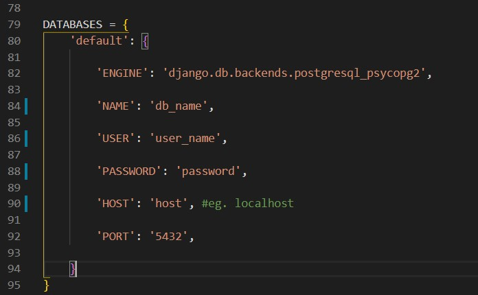
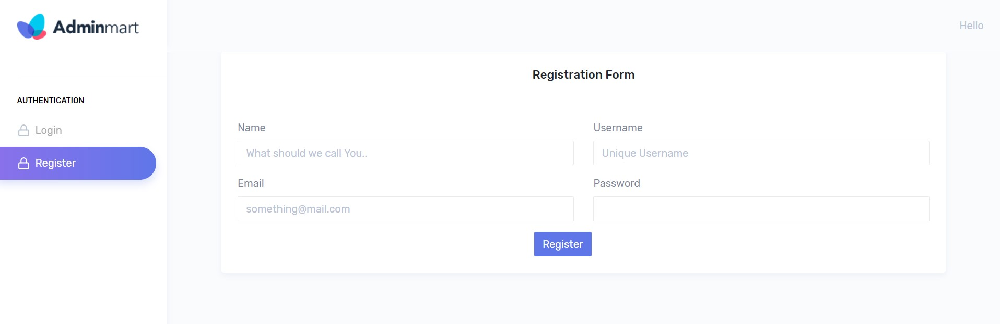
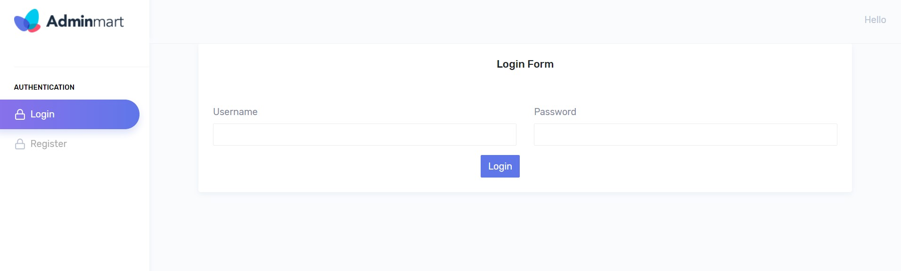
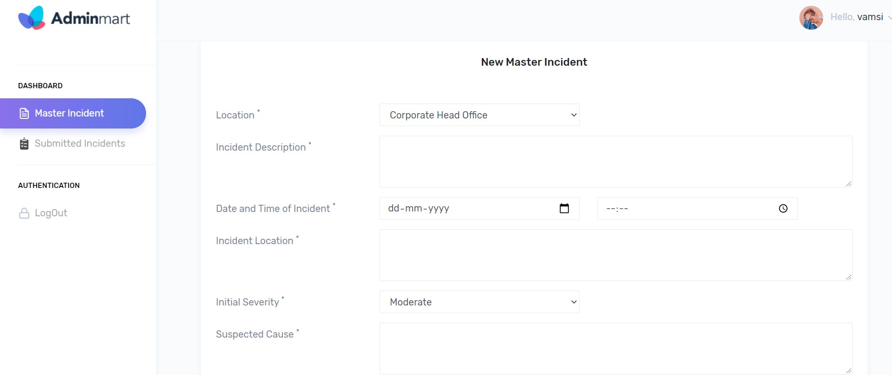
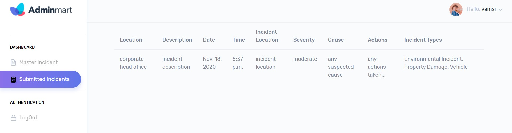

# Django_Form_Submission_App

---

## Overview

This is a simple Django web app that shows an example of form submission and displaying data in table..

#### This app Consists of below mentioned features.
- User Registration and Validation.
- User Authentication.
- Form Handling.
- Saving Form Data into Database.
- Working with [Messaging framework](https://docs.djangoproject.com/en/3.1/ref/contrib/messages/) in Django.

## Installation Intsructions

Activate virtual environment if you wish.

This app installation requires [PIP](https://pip.pypa.io/en/stable/).

#### Install the dependencies and start the server.

```sh
$ cd to/this/project/directory/
$ pip install -r requirements.txt
```
#### Linking to Database.
    
- Create a postgres Database, and link it to Django Application via **settings.py** file.
- The Structure looks like this: 
--   

#### Running Server

```sh
$ python manage.py runserver
```

Verify the web app is working or not,  by navigating to your server address in your preferred browser.

```sh
127.0.0.1:8000
or
http://localhost:8000/
```

## Snapshots

#### User Registration Page:


#### User Login Page:



#### Form Filling Page:




#### Viewing Submitted Forms Page:



#### Displaying Messages from Backend:


